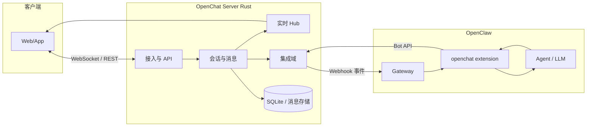

# OpenChat 技术架构（设计稿）

**状态**：设计稿，随实现迭代修订。  
**依据**：`README.md` 产品定位、`workflow/01-research/` 调研结论。

---

## 1. 目标与边界

| 项 | 说明 |
|----|------|
| **产品** | 类微信体验的 **开源** IM/社交能力：私聊、群聊、消息与资料、后续可扩展朋友圈级能力等（分阶段）。 |
| **差异化** | **开放**：协议与实现可审计、可私有部署；**可接 OpenClaw**，使聊天成为人与 Agent 的协作界面。 |
| **实现语言** | 服务端核心 **Rust**（性能、并发、单二进制分发）。 |
| **参考** | 工程形态参考 **VoceChat 服务端**（轻量、REST/OpenAPI、Bot/Webhook）；OpenClaw 侧通过其 **channel / 插件** 模型对接（见第 7 节）。 |

**不在本文展开**：具体 OpenAPI 字段、表结构 DDL、UI 线框；见 [02-数据模型.md](./02-数据模型.md) 与后续 `openapi.yaml`。

---

## 2. 技术栈

**OpenChat 服务端采用 Rust 作为唯一指定的后端实现语言**（IM 核心、HTTP/WebSocket、持久化、与 OpenClaw 的集成适配层均用 Rust 编写）。

| 层级 | 选型 |
|------|------|
| **语言** | **Rust**（Edition 以仓库 `Cargo.toml` 为准；统一 `fmt`/`clippy` 约束。） |
| **异步运行时** | **Tokio**（与主流 HTTP、WebSocket、数据库异步驱动配套。） |
| **Web 与协议** | HTTP(S) + WebSocket；REST 与 OpenAPI 文档；具体框架（如 Axum、Poem 等）在实现阶段于 `03-plan` 或代码仓库锁定。 |
| **持久化** | **SQLite** + 迁移工具（如 SQLx migrate）首版；消息与元数据是否分库按负载演进。 |
| **文件与对象** | 本地目录或兼容 S3 的接口抽象，服务端仍以 Rust 实现。 |
| **OpenClaw** | **独立进程**，技术栈为官方实现的 **Node.js / TypeScript**；与 OpenChat 仅通过 **HTTP/JSON 契约** 集成，**不要求**用 Rust 重写 OpenClaw。 |
| **客户端** | Web / 桌面 / 移动分阶段；技术栈可独立于 Rust，须遵守本仓库对外 **OpenAPI** 与实时协议。 |

**原则**：除第三方系统（OpenClaw）与客户端外，**OpenChat 自有服务端能力不以其他语言实现**，避免多语言后端并行带来的运维与契约分裂。

---

## 3. 架构原则

1. **契约清晰**：客户端、Bot、OpenClaw 之间以 **版本化 HTTP/JSON**（及流式扩展）为主，避免隐式耦合。  
2. **先落库后投递**：用户消息默认 **持久化成功** 再进入推送与外部集成，降低丢消息与重复投递风险（可配置异步化以换延迟）。  
3. **防 Bot 回灌**：凡经 Agent/Bot 产生或转发的消息带 **`sender_kind` / `is_bot` 等显式标记**，OpenClaw 连接器侧 **忽略** 可导致自激回路的入站。  
4. **可替换集成**：OpenClaw 为 **外部系统**；OpenChat 不因绑定 OpenClaw 而无法独立运行（OpenClaw 关闭时仍为完整 IM）。  
5. **从简演进**：首版以 **单地域、单进程部署 + SQLite** 为主；水平扩展、多副本、消息队列列为后续章节。

---

## 4. 逻辑分层

```text
┌─────────────────────────────────────────────────────────────┐
│  客户端层（Web / 桌面 / 移动，后续分阶段）                      │
│  REST + WebSocket（长连接同步、可选 SSE/流式）                  │
└───────────────────────────────┬─────────────────────────────┘
                                │
┌───────────────────────────────▼─────────────────────────────┐
│  接入层（API Gateway）                                         │
│  TLS、限流、鉴权、路由、OpenAPI 聚合                            │
└───────────────────────────────┬─────────────────────────────┘
                                │
        ┌───────────────────────┼───────────────────────┐
        │                       │                       │
┌───────▼───────┐     ┌─────────▼─────────┐   ┌─────────▼─────────┐
│  会话与消息域  │     │  实时与在线状态    │   │  集成域           │
│  用户/群/消息  │     │  WebSocket  Hub    │   │  OpenClaw 适配   │
│  已读/序号等   │     │  广播/订阅         │   │  Webhook / Bot   │
└───────┬───────┘     └─────────┬─────────┘   └─────────┬─────────┘
        │                       │                       │
        └───────────────────────┼───────────────────────┘
                                │
┌───────────────────────────────▼─────────────────────────────┐
│  数据与持久化                                                  │
│  元数据（SQLite 起步）+ 消息存储（可独立子系统，参考 VoceChat）   │
│  对象存储接口（文件/图片，本地目录或 S3 兼容，后续）              │
└─────────────────────────────────────────────────────────────┘
```

---

## 5. 核心组件职责

| 组件 | 职责 |
|------|------|
| **接入层** | HTTP(S) 统一入口；JWT/会话 Cookie、设备维度；**Bot/API Key** 与 **用户会话** 分流；限流与审计日志。 |
| **会话与消息域** | 用户、关系链、群组、消息 CRUD、游标/序号拉取历史、**幂等与去重**（客户端 `client_msg_id` 等）。 |
| **实时 Hub** | 维护在线用户与订阅；下行消息广播；支持 **分片增量**（如 AI 流式回复的多段推送）。 |
| **集成域（OpenClaw）** | **出站**：符合条件时向 OpenClaw Gateway 推送标准化事件；**入站**：校验 OpenClaw 回调或 OpenChat 侧 Bot API 调用，将回复写入会话并走实时 Hub。 |
| **管理 / 运营** | 可选：邀请、审核、基础风控（后续）。 |

---

## 6. 数据架构（首版建议）

| 类型 | 策略 | 说明 |
|------|------|------|
| **账户与关系** | SQLite + 迁移工具（如 SQLx） | 用户、设备、群、成员、设置。 |
| **消息** | 同库或 **独立消息库/目录**（演进） | 高吞吐时可拆「元数据 DB」与「消息体存储」，与 VoceChat 的 MsgDb 思路类似。 |
| **文件** | 本地 `data/files/` + URL 引用 | 不存大对象进 SQL；后续可换对象存储。 |
| **序列与 ID** | 单进程内单调序号；多副本阶段再引入分布式 ID / 分段。 |

---

## 7. OpenClaw 集成架构

OpenClaw 以 **Node/TypeScript** 实现，通过 **`extensions/<channel>`** 扩展通道。OpenChat 不修改 OpenClaw 核心，采用 **双端契约**：

### 7.1 OpenChat → OpenClaw（出站）

- 触发条件：某会话开启「AI 助手」、或消息 `@` 了 Bot 等（产品规则可配置）。  
- 传输：HTTPS **Webhook** 或 OpenClaw 文档约定的 **HTTP 入站** 形态，将 **标准化事件 JSON**（会话 ID、用户 ID、消息 ID、正文、附件元数据、**sender_kind**）POST 到 Gateway 侧。  
- 安全：HMAC 签名或 mTLS（部署阶段选型）。

### 7.2 OpenClaw → OpenChat（入站）

- OpenClaw 扩展内调用 OpenChat 提供的 **Bot API**（如 `POST /api/v1/bot/...`，路径以最终实现为准）：**Bearer / API Key**，将 Agent 回复写入指定会话。  
- 回复经 **落库** 后，由 **实时 Hub** 推送给在线客户端。

### 7.3 OpenClaw 仓库内新增扩展

- 在 OpenClaw 侧新增 **`openchat` channel 扩展**（类比 `telegram`）：注册 `openclaw.channel`、实现 inbound 映射与 outbound 调用。  
- 配置项：OpenChat Base URL、Token、Webhook 路径；与 OpenClaw 既有 `channels` / `gateway` 配置一致。



---

## 8. 实时与流式

| 场景 | 建议 |
|------|------|
| **普通消息** | WebSocket 推送完整消息或「已写入」通知 + 客户端拉取（按实现复杂度二选一或混合）。 |
| **AI 流式** | 长连接上推送 **chunk**（带 `stream_id`、序号、`done` 标记）；与 OpenClaw/LLM 流式输出对齐。 |

---

## 9. 安全要点

- **鉴权**：用户 JWT/刷新；Bot 与 OpenClaw 使用 **独立 API Key**，最小权限。  
- **OpenClaw**：遵循其 DM pairing 等安全模型；OpenChat 侧对 **Webhook 入站** 验签、防重放。  
- **防回灌**：第 3 节原则；连接器层单元测试覆盖。  
- **隐私**：默认私有化部署，敏感配置 **环境变量 + 密钥管理**，不进仓库。

---

## 10. 部署视图（首版）

- **单进程**：一个二进制 + `data/` 目录；前置 **Nginx/Caddy** 终止 TLS 可选。  
- **OpenClaw**：独立进程或容器，与 OpenChat **同机或同内网**，通过 **HTTPS** 互通。

---

## 11. 演进路线（与架构无关的「路线图」仅作占位）

| 阶段 | 架构侧重 |
|------|----------|
| **MVP** | 单进程、SQLite、私聊/小群、基础 Bot、单向 OpenClaw 打通；OpenAPI 文档化。 |
| **成长** | 读写分离、消息分库、对象存储、观测（metrics/tracing）。 |
| **规模化** | 多实例、队列与去重、联邦或跨域（若产品需要）。 |

---

## 12. 修订记录

| 版本 | 日期 | 说明 |
|------|------|------|
| 0.1 | 2026-03-22 | 初稿：分层、数据、OpenClaw 双端、安全与部署 |
| 0.2 | 2026-03-22 | 新增「技术栈」节：明确服务端唯一语言为 Rust，顺延章节编号 |
